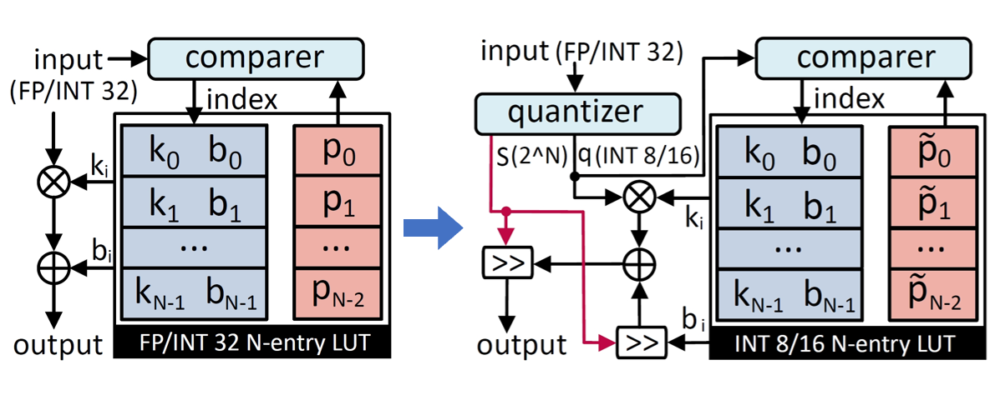

# Genetic Quantization-Aware Approximation for Non-Linear Operations in Transformers
The official PyTorch implementation of ["Genetic Quantization-Aware Approximation for Non-Linear Operations in Transformers"](http://arxiv.org/abs/2403.19591) [DAC 2024]



## Installation
Clone this repo with submodules:
```
git clone https://github.com/PingchengDong/GQA-LUT
cd GQA-LUT/
```

The code is tested with Python3.7, PyTorch == 1.5. We recommend you to use [anaconda](https://www.anaconda.com/) to make sure that all dependencies are in place. To create an anaconda environment:
```
conda env create -f environment.yml
conda activate gqa-lut
```

## Support List
```
├──Non-linear operations
    ├──GELU
    ├──HSwish
    ├──Sigmoid
    ├──Exponent
    ├──Reciprocal
    ├──Reciprocal of square root
    ├──...
```

## Approximation
Example: to approximate ```GELU``` with 8 segpoints:
```
python gqa_lut_trainer.py --act_func 'gelu' --x_range -4 4 --sp_range -4.0 4.0 --num_splits 7 --decimal_bit_range 0 6 --total_iters 500 --mutate
```
We provide some pretrained jsons for several non-linear operations with 8 & 16 segpoints, which are mostly used in neural network in the ```pretrained``` folder.

To assist you in reproducing our results as accurately as possible, we provide a Makefile file. It includes the parameter settings and execution methods for several supported non-linear functions in the GQA-LUT code mentioned above.

For example, for GQA-LUT approximation of GELU function with 8 segpoints, running:
```
make gelu_8
```

## GQA Hardware Python Model
We also provide a basic pytorch style python model for hardware simulation for those who are interested in applying the GQA 
in real implementation. The code ```gqa_lut_op.py``` will help you to simulate the hardware processing of the non-linear function
approximation with the LUT style. The input and output will be in INT8 format, and the intermediate results are all restricted 
with the operation precision. You may change the simulation code to meet the situation of your hardware implementation.

## Citation
```
@inproceedings{dong2024gqalut,
  author    = author={Dong, Pingcheng and Tan, Yonghao and Zhang, Dong and Ni, Tianwei and Liu, Xuejiao and Liu, Yu and Luo, Peng and Liang, Luhong and Liu, Shih-Yang and Huang, Xijie and Zhu, Huaiyu and Pan, Yun and An, Fengwei and Cheng, Kwang-Ting},
  title     = {Genetic Quantization-Aware Approximation for Non-Linear Operations in Transformers},
  booktitle = {Design Automation Conference (DAC)},
  year      = {2024}
}

```
